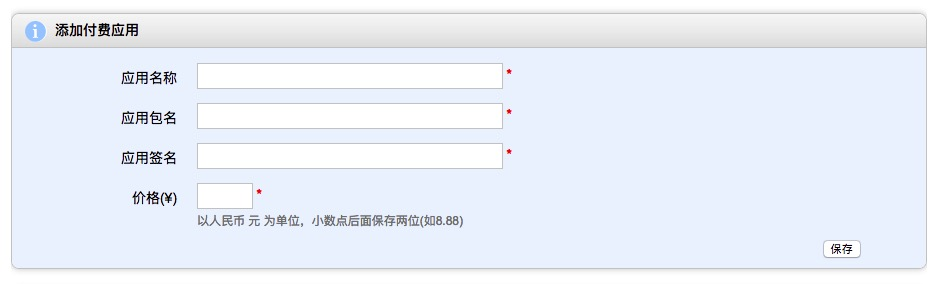

# 应用汇付费游戏解锁 SDK

应用汇付费游戏解锁 SDK 为您的游戏提供一次性购买功能，增强游戏变现能力

集成了解锁 SDK 的游戏在运行时会先请求应用汇客户端申请解锁，用户可以在应用汇客户端内完成购买以及解锁操作，解锁成功后方可开始游戏

### 1. 集成前准备

#### 1.1. 注册开发者并实名认证

首先到应用汇开发者网站 http://dev.appchina.com 注册成为开发者，然后登录开发者网站进行实名认证，只有认证审核通过后才能进行下一步

#### 1.2. 生成应用汇公钥并配置开发者公钥
实名认证后依次点击 `上传新软件` -> `付费应用管理` 进入付费应用管理页面，如下所示：


1. 点击 `生成应用汇公钥` 按钮生成应用汇公钥，后面集成 SDK 时会用到
2. 点击 `下载秘钥生成代码` 链接下载生成秘钥的代码 ZIP 压缩包，下载后解压压缩包得到 `KeyGenerator.class` 文件
3. 打开命令行，进入 `KeyGenerator.class` 文件所在目录，执行如下命令（请使用 Java 7 以上版本执行）：
  ```shell
  java KeyGenerator
  ```
  结果如下所示（仅供参考，请不要复制这里的秘钥使用）：

  ```shell
  ==================开发者公钥 填写到开发者后台=============
  MIGfMA0GCSqGSIb3DQEBAQUAA4GNADCBiQKBgQC7xxID9vnmCveOHMCxhzYkKsbydgELxwU3KQ2g
  cRgPrnnN7arz9XNjpcPfIOxX9zsoidj8vCy7xP8SNNzjxLtBRviHH6OWgFUXuqvh9iG5f669K8ZI
  b0pOo0ffle2rr3d+oxT2Wv5+5/cyFA+wqKgGZkwte+z0HU5Q8+3wwQ9/PQIDAQAB

  ==================开发者私钥 务必保存好，请勿泄露=============
  MIICeAIBADANBgkqhkiG9w0BAQEFAASCAmIwggJeAgEAAoGBAIKoq+nXVHRpnVWvgBpMFqo6CKDM
  MzXbt4e98luRBvvtcR+u7Y/7yl6WRNujLGiN4NnsGlyS8eFEyBs2kCE5smmvQVldMYck4mnEPAzP
  /WK40FZ+LB5/mkby1DSHSGJefv/gHyIXyIkY1PGetxiHv9eVqFxyskoZk0WJxsp8AQzjAgMBAAEC
  gYAQjKbBxrl2yU3ZZZJXQl34j8M6AsNVxg+4DNIe0P7OeCPE/JYwj5bxZh0wqLleQOJDGAm6wg4L
  F3g1IjMdUj6Lv7PofjKm637PM9GYNSNKQwAcfSMk75V7NhK/36PHxWwnY8QQupQt7X1+imTKvHdv
  SRNm8mKtUZQ39wIHvnCTWQJBAM3osmsB8RopytyL7NS1f/URuwrvXy4NslDRidM6lQ4ZAA4VjrAQ
  V6xHVaXA3hxi9TOZhTDOyRQi/nl0dPE89RcCQQCicag1CrK/wiDvvk9zuaQW6FlaZE/3BZoLJN6g
  FJrap6moLIhgIsJhcBhCgRB4L9XQyC++LyHHzeu9lDceod4VAkEAoTtFgd7qYLc63sk+MCzSvh4d
  HOnk2JXm+7untVuY3Yob7etZaGnTjNXqrbjA8u9V2wqqLVauQvNH2eijrUYzDwJBAJW7HciGa+zF
  C4bwbFvHKbDTyki/XdXbm/nZqjrzwyj4kjEpmyrB31ng8Pub64pczUD8xMUQvJpm/HxqOcRKf2EC
  QQCtYwQMBxrhbppQL73rApj5vUCixA84J8o+mwa0s+5vJdHN4ubit7R8ztrARhmWG4tLOUZHEo2u
  RxThLn7N6isH
  ```
4. 拷贝上一步生成的 `开发者公钥` 填入应用汇开发者网站 `付费应用管理` 页面的`开发者公钥` 输入框里并点击保存
5. 保存好第 3 步生成的 `开发者私钥`，后面集成 SDK 时会用到

### 2. 集成 SDK

#### 2.1. 导入 SDK

##### Android Studio
只需在 app module 的 build.gradle 文件中加入编译依赖即可，如下：

```groovy
implementation 'com.appchina:app-unlock:$last_version'
```

请自行替换 `$last_version` 为最新的版本号（蓝色框框内的就是版本号）： [ ![Download][download_badge_icon]][download_page]

注意：
* 如果你使用的是 3.0 以下版本 Android Gradle 插件，请将 `implementation` 替换为 `compile`

##### Eclipse

如果你使用的是 Eclipse，且现阶段无法替换为 Android Studio，请参考文章 [【Android】1分钟不用改任何代码在Eclipse中使用AAR][aar_to_library_url] 将 AAR 转成 Eclipse Library 使用，[点我去下载 AAR 文件][download_page]

#### 2.2. 编码申请解锁

在 app 入口 Activity 的 onCreate 方法中申请解锁，如下：

```java
public class MainActivity ... {
    @Override
    protected void onCreate(@Nullable Bundle savedInstanceState) {
        super.onCreate(savedInstanceState);

        /* 先使用之前得到的应用汇公钥和开发者私钥创建 AppInfo */
        String acPubKey = ...;  // 应用汇公钥
        String devPriKey = ...; // 开发者私钥
        AppInfo appInfo = new AppInfo(acPubKey, devPriKey);

        // 然后申请解锁
        AppUnlocker.unlock(this, appInfo, new UnlockCallbackImpl(this));
    }

    private static class UnlockCallbackImpl implements UnlockCallback {
        WeakReference<MainActivity> activityWeakReference;

        UnlockCallbackImpl(MainActivity activity) {
            this.activityWeakReference = new WeakReference<>(activity);
        }

        @Override
        public void onSucceed() {
            MainActivity activity = activityWeakReference.get();
            if (activity != null) {
                // 到这里就解锁成功了，可以在这里加载游戏资源
            }
        }

        @Override
        public void onCanceled() {
            MainActivity activity = activityWeakReference.get();
            if (activity != null) {
                // 用户取消解锁，退出游戏
                activity.finish();
            }
        }
    }
}
```

其它方法：
* AppUnlocker.isUnlocked(Context): 判断是否已解锁
* AppUnlocker.lock(Context): 锁定 app，下次进入游戏就需要重新解锁

### 3. 添加付费应用

#### 3.1. 上传 APP

集成完 SDK 后，打包正式版 app，然后前往应用汇开发者网站，上传 app 或更新版本

#### 3.2. 添加付费应用

前往付费应用管理页面添加付费应用信息，如下图所属：



* 应用名称：app 的名称，这里填的名称仅在 `付费应用列表` 中展示
* 应用包名：app 的包名，也叫 `applicationId`，使用 Android Studio 开发的话一定要填 build.gradle 中配置的 `applicationId` 的值
* 应用签名：[点击下载 app 签名查看器][view_sign_app_dl_url] 并安装，打开后找到你的 app，将显示的签名填到 `应用签名` 输入框里
* 价格：app 的价格，单位元

信息填完后，点击保存，等待审核

#### 3.3. 审核

审核周期一般为 2 个工作日，审核通过后就可以测试您的游戏了，如遇审核不通过需要修改应用签名的，只需重新添加相同应用包名的付费应用即可

### 4. FAQ

#### 4.1. 常见错误提示

[download_badge_icon]: https://api.bintray.com/packages/ac-android/maven/app-unlock/images/download.svg
[download_page]: https://bintray.com/ac-android/maven/app-unlock/_latestVersion
[aar_to_library_url]: http://www.jianshu.com/p/ccf306e08d5b
[view_sign_app_dl_url]: https://github.com/ac-android/app-unlock-sdk/raw/master/art/app_sign_viewer.apk
